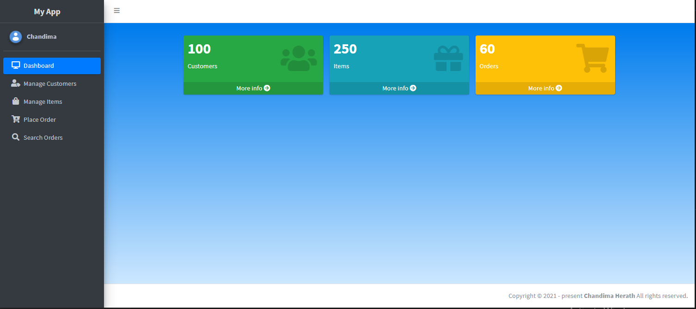

# Web App using adminLTE and raw AJAX 

## Version
1.0.0

## License
Copyright © Chandima Herath. All Rights Reserved. License under the [MIT](LICENSE.txt) License.

-----
## About

This is a front-end for a web app which is developed using HTML CSS and mainly adminLTE and Boostrap.The API connectivity gained using AJAX. This lets the user to deal with basic crud operations of a point of sales system. Redesigning and distribution is allowed.

----
## How to Use

* Clone the Repository
* Open via vsCode or suitable IDE
* Run npm install
* Build and Run !

----
## V.1.0.0 Screens

-----
-----

---

----

---

---

----
----
